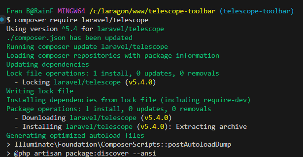

# Laravel Telescope Toolbar

This repo is not Telescope Toolbar, but only me who want to try it.s

[https://x.com/MadeWithLaravel/status/1886023011960049888](https://x.com/MadeWithLaravel/status/1886023011960049888)

## Step by Step

```bash
composer require laravel/telescope
```



```bash
php artisan telescope:install
```


```bash
php artisan vendor:publish --tag=telescope-migrations
```


If you have this case, please delete one of duplicate migration


Please delete one of migration if duplicate

```bash
php artisan migrate
```


```bash
composer require fruitcake/laravel-telescope-toolbar --dev
```


```bash
php artisan vendor:publish --provider="Fruitcake\\TelescopeToolbar\\ToolbarServiceProvider"
```


So, you can check it


## Feature


Check URL


Duration and memory


Check session


Account


Model


How many query in one page


How many model in one page


Web version and environment

## Source

[https://github.com/ZhafranBahij/exercise-telescope-toolbar](https://github.com/ZhafranBahij/exercise-telescope-toolbar)

[https://github.com/fruitcake/laravel-telescope-toolbar](https://github.com/fruitcake/laravel-telescope-toolbar)
